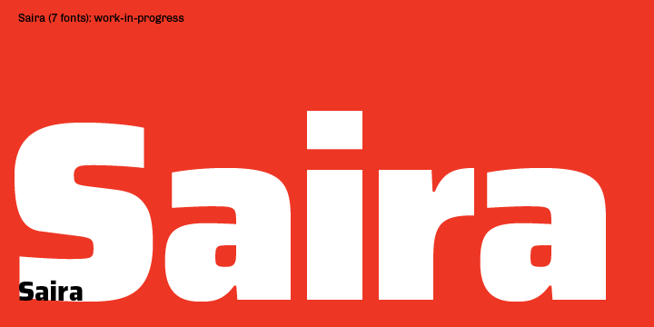

# Saira family

**Omnibus-Type**  
*SIL Open Font License, 1.1*

Saira is a sans serif system developed in four widths: Saira, Saira Semi Condensed, Saira Condensed and Saira Extra Condensed, each with nine (9) variants (Extra Light, Light, Regular, Semi Bold, Bold, Extra Bold and Black).

####Saira Family contains:
* Thin
* ExtraLight
* Light
* Regular
* Medium
* SemiBold
* Bold
* ExtraBold
* Black
* Semicondensed Thin
* Semicondensed ExtraLight
* Semicondensed Light
* Semicondensed Regular
* Semicondensed Medium
* Semicondensed SemiBold
* Semicondensed Bold
* Semicondensed ExtraBold
* Semicondensed Black
* Condensed Thin
* Condensed ExtraLight
* Condensed Light
* Condensed Regular
* Condensed Medium
* Condensed SemiBold
* Condensed Bold
* Condensed ExtraBold
* Condensed Black
* Extracondensed Thin
* Extracondensed ExtraLight
* Extracondensed Light
* Extracondensed Regular
* Extracondensed Medium
* Extracondensed SemiBold
* Extracondensed Bold
* Extracondensed ExtraBold
* Extracondensed Black

To contribute to the project contact [Omnibus-Type](http://omnibus-type.com/).

### Designers

* Hector Gatti

### License

Copyright (c) 2013-2016, Omnibus-Type (www.omnibus-type.com omnibus.type@gmail.com)

Licensed under the [*SIL Open Font License, 1.1*](http://scripts.sil.org/OFL); you may not use this file except in compliance with the License.

======
## FONTLOG for the Saira fonts

This file provides detailed information on the Saira font software.  
This information should be distributed along with the Saira fonts and any derivative works.

### Saira is a typeface family that supports the following Unicode language range: 

* Basic Latin 				U+0020-U+007E
* Latin-1 Supplement 		U+00A0-U+00FF
* Latin Extended-A 			U+0100-U+017F
* Latin Extended Additional*	U+1E00-U+1EFF *(111/256)

**Character map to support MS Codepages:**
* 1252 Latin-1
* 1250 Latin-2 (Easter Europe)
* 1254 Turkish
* 1257 Windows Baltic
* 1258 Vietnamese
* Mac Roman

*To contribute to the project contact Omnibus-Type at omnibus.type@gmail.com*

**2016 July 9 (v0.071) New Weight - Nicolás Silva Schwarzenberg**

- Two new weights (from 7 to 9) and new instances distribution in the weight axis

**2016 June 4 (v0.070) Initial Commit - Nicolás Silva Schwarzenberg**

- Initial Commit

### Acknowledgements

If you make modifications be sure to add your name (N), email (E), web-address
(if you have one) (W) and description (D). This list is in alphabetical order.

**N:** **Nicolas Silva Schwarzenberg**  
**E:** nsilva.design@gmail.com  
**W:** http://www.omnibus-type.com  
**D:** Typeface development  

**N:** **Hector Gatti**  
**E:** omnibus.type@gmail.com  
**W:** http://www.omnibus-type.com  
**D:** Designer