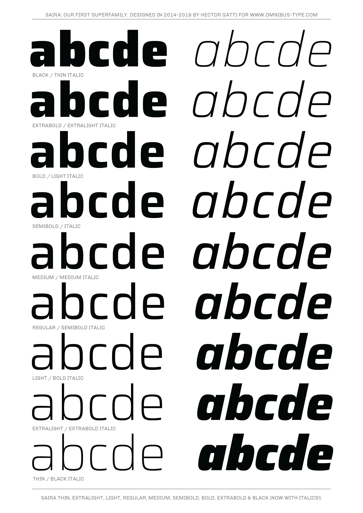

# Saira family

**Gatti & Omnibus-Type Team**
*SIL Open Font License 1.1,*
*18 fonts, 885 glyphs each variant (Press Series).*
*Tipos Latinos 2014*

Saira is a contemporary sans serif system, a versatile family of 18 styles (9 different weight vari ants, plus matching italics.) It is part of the Press Series, for it is applicable in newspapers, magazines, books and websites. Showing high adaptability, it can be used in headlines and long texts. The original masters were designed by Héctor Gatti. The character sets were later completed by the Omnibus-Type Team.

#### Saira Family contains:
* Thin / Thin Italic
* ExtraLight / ExtraLight Italic
* Light / Light Italic
* Regular / Italic
* Medium / Medium Italic
* SemiBold / SemiBold Italic
* Bold / Bold Italic
* ExtraBold / ExtraBold Italic
* Black / Black Italic

To contribute to the project contact [Omnibus-Type](http://omnibus-type.com/).

### Designers

* Héctor Gatti

### License

Copyright (c) 2020, Omnibus-Type (www.omnibus-type.com | omnibus.type@gmail.com)

Licensed under the [*SIL Open Font License, 1.1*](http://scripts.sil.org/OFL); you may not use this file except in compliance with the License.

======
## FONTLOG for the Saira fonts

This file provides detailed information on the Saira font software.  
This information should be distributed along with the Saira fonts and any derivative works.

### Saira is a typeface family that supports the following Unicode language range: 

* Basic Latin 					U+0020-U+007E
* Latin-1 Supplement 			U+00A0-U+00FF
* Latin Extended-A 				U+0100-U+017F
* Latin Extended Additional*	U+1E00-U+1EFF *(111/256)

**Character map to support MS Codepages:**
* 1252 Latin-1
* 1250 Latin-2 (Easter Europe)
* 1254 Turkish
* 1257 Windows Baltic
* 1258 Vietnamese
* Mac Roman

*To contribute to the project contact Omnibus-Type at omnibus.type@gmail.com*

**2020 February 5 (v1.001) Configuring axes (Omnibus-Type)**
- New variable font
- Corrected axes for better performance
– Adding Ultra Condensed style
- Adding Semi Expanded style
– Adding Expanded style

**2019 August 5 (v0.072) fixing some glyphs (Omnibus-Type)**
- Small fixes on ellipsis and j dotaccent

**2018 October 29 (v0.072) New Italics (Omnibus-Type)**
- Updated to GF Latin Plus set
- Supports 218 Latin languages used in 212 countries

**2016 July 9 (v0.071) New Weight (Omnibus-Type)**
- Two new weights (from 7 to 9) and new instances distribution in the weight axis

**2016 June 4 (v0.070) Initial Commit (Omnibus-Type)**
- Initial Commit

### Acknowledgements

If you make modifications be sure to add your name (N), email (E), web-address
(if you have one) (W) and description (D). This list is in alphabetical order.

**N:** **Héctor Gatti**  
**E:** omnibus.type@gmail.com  
**W:** http://www.omnibus-type.com  
**D:** Designer

**N:** **Nicolás Silva Schwarzenberg**  
**E:** nsilva.design@gmail.com  
**W:** http://www.omnibus-type.com  
**D:** Typeface development  

**N:** **Yorlmar Campos**  
**E:** omnibus.type@gmail.com  
**W:** http://www.omnibus-type.com  
**D:** Typeface development
